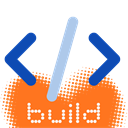

<p align="center">
  
</p>

# Build Inbox

**Voice + screenshots + URL context -> local Build Brief -> Codex task.**

Build Inbox is a local-first Chrome extension and Node.js helper for capturing quick coding, product, UX, bug, and implementation walkthroughs. It records your voice, browser transcript, visible-tab screenshots, page URL, title, and timing context, then saves a structured task bundle inside the selected project repo.

No cloud backend is required. OpenAI API usage is optional, helper-only, and off by default.

Built with 🧡 by [TwoGuysOneCat](https://www.twoguysonecat.com).

## Status

Build Inbox is being prepared for a Chrome Web Store listing. In the meantime, you can run it locally in Chrome Developer Mode as an unpacked extension.

This is an MVP. The core capture flow works, but expect some rough edges while the Chrome Store package and installer flow are being polished.

## What It Creates

Each saved capture is written into the selected repo:

```text
repo/
  .build-inbox/
    inbox/
      2026-06-01-1432-onboarding-flow/
        brief.md
        codex-prompt.md
        issue.md
        metadata.json
        audio.webm
        transcript.raw.txt
        transcript.final.txt
        screenshots/
          001.png
          002.png
```

`codex-prompt.md` is ready for Codex. You can launch it through the local Codex CLI, or open/use the prompt manually in Codex chat.

## Requirements

- Node.js 20+
- Google Chrome
- A local project repo to save captures into
- Optional: OpenAI API key for transcription/cleanup
- Optional: Codex CLI for one-click `Send to Codex`
- Optional: GitHub CLI for creating issues later

## Install The Helper

Clone the repo, install dependencies, build the TypeScript helper, then link the CLI locally:

```bash
npm install
npm run build
npm link
```

Check the CLI:

```bash
build-inbox --help
```

## Load The Chrome Extension

Until the Chrome Web Store listing is available:

1. Open `chrome://extensions`.
2. Turn on **Developer mode**.
3. Click **Load unpacked**.
4. Select the `extension/` folder from this repo.
5. Click the Chrome extensions puzzle-piece icon.
6. Pin **Build Inbox** to the toolbar.

The extension includes a stable development key, so the expected local extension ID is:

```text
aidbkhnchloaafdfbadlcnaimnaloglf
```

If Chrome shows a different ID, use the ID shown on `chrome://extensions`.

## Connect The Local Helper

Build Inbox uses Chrome Native Messaging so the extension can talk to the local helper without storing secrets or writing directly from Chrome.

Run setup with your extension ID:

```bash
build-inbox setup --extension-id aidbkhnchloaafdfbadlcnaimnaloglf
```

Then reload the extension in `chrome://extensions`.

On Windows, setup registers:

```text
HKCU\Software\Google\Chrome\NativeMessagingHosts\com.build_inbox.helper
```

The helper config lives at:

```text
~/.build-inbox/config.json
```

## Add A Project

From the CLI:

```bash
build-inbox projects:add
```

Or provide everything in one command:

```bash
build-inbox projects:add --name "TV Studio" --repo "C:\Code\tv-studio" --github "paolo/tv-studio" --url-match "localhost:3000,tv-studio.local"
```

You can also add a project in the side panel with the `+` button beside **Project**.

Build Inbox uses `urlMatches` to auto-select the right repo when you open a matching local or staging URL.

## Capture Flow

1. Open a project page in Chrome.
2. Click the Build Inbox toolbar button.
3. Choose or add the project.
4. Press **Start** or use `Ctrl+Shift+Space` / `Cmd+Shift+Space`.
5. Talk through the bug, UX issue, feature, note, decision, or refactor.
6. Press **Shot** or use `Ctrl+Shift+S` / `Cmd+Shift+S` for screenshots.
7. Press **Stop**.
8. Review or edit the transcript.
9. Press **Save**.
10. Press **Codex** if the local Codex CLI is installed, or use the saved `codex-prompt.md` manually.

Keyboard shortcuts can be changed at:

```text
chrome://extensions/shortcuts
```

## OpenAI API Is Optional

You can use Build Inbox without an OpenAI API key. Browser speech recognition and manual transcript editing still work.

If you enable OpenAI transcription:

- The API key is handled only by the local helper.
- The Chrome extension never stores or sees the key.
- Audio may be sent to OpenAI for transcription.
- Screenshots are not sent to OpenAI.
- Cleanup/classification sends transcript text plus screenshot markers/filenames only, not screenshot images.

The easiest helper-only key setup is:

```bash
build-inbox openai:key:set
```

Environment variable option:

```powershell
setx OPENAI_API_KEY "your-key-here"
```

Restart Chrome after using `setx`, because Chrome-launched native helpers inherit Chrome's environment.

Enable OpenAI transcription:

```bash
build-inbox transcription:mode openai
```

Enable optional transcript cleanup/classification:

```bash
build-inbox cleanup:enable
```

Disable them again:

```bash
build-inbox transcription:mode browser
build-inbox cleanup:disable
```

Usage estimates are logged locally:

```text
~/.build-inbox/usage.jsonl
```

## Codex CLI Vs Codex Chat

Build Inbox supports both workflows.

### Codex CLI

The side panel **Codex** button asks the local helper to run:

```bash
build-inbox codex:run <session-id>
```

That command resolves the saved capture folder, runs `codex` from the selected repo root, passes `codex-prompt.md`, and attaches screenshots with `--image`.

If the side panel says `Codex CLI not found`, it means Chrome/the helper cannot find a local `codex` command. Being signed in to Codex chat does not automatically install the CLI command.

You can preview the launch command without running it:

```bash
build-inbox codex:run <session-id-or-path> --dry-run
```

### Codex Chat

If you prefer this chat, press **Save**, then ask Codex chat to process the latest capture in:

```text
<your-repo>/.build-inbox/inbox/
```

You can also open the saved `codex-prompt.md` and use it as the prompt. Attach the screenshots manually if your chat session cannot read local image files.

## Privacy And Git

Build Inbox defaults to private mode. When a project is saved, the helper appends Build Inbox ignore rules to that project repo so local captures stay out of Git unless you deliberately promote them.

In private mode, these folders are ignored in target repos:

```gitignore
.build-inbox/inbox/
.build-inbox/done/
.build-inbox/archive/
.build-inbox/config.local.json
```

The extension does not use a cloud backend and does not upload screenshots.

## CLI Commands

```bash
build-inbox setup [--extension-id EXTENSION_ID]
build-inbox projects:list
build-inbox projects:add [--name NAME --repo PATH --github owner/repo --url-match a,b]
build-inbox projects:edit <project-id>
build-inbox capture:save --payload capture.json
build-inbox capture:transcribe <session-id-or-path>
build-inbox codex:run <session-id-or-path> [--dry-run]
build-inbox github:create-issue <session-id-or-path> [--title TITLE]
build-inbox openai:key:set
build-inbox openai:key:status
build-inbox openai:key:clear
build-inbox transcription:mode <browser|openai|manual>
build-inbox cleanup:enable
build-inbox cleanup:disable
```

GitHub issue creation uses the GitHub CLI and is not required for the core capture workflow.

## Development

```bash
npm install
npm run build
npm run lint
npm test
```

After changing extension files, reload the unpacked extension at `chrome://extensions`.

## Repository Layout

```text
extension/        Chrome MV3 extension and side panel UI
src/              TypeScript CLI, helper, Native Messaging host, templates
fixtures/         Test capture payloads
dist/             Build output, ignored by Git
```

## License

MIT. Copyright (c) 2026 TwoGuysOneCat.
